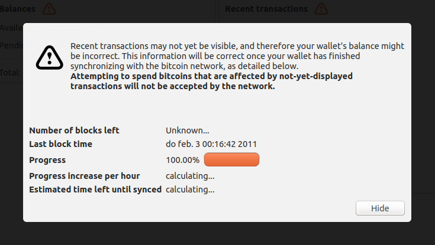
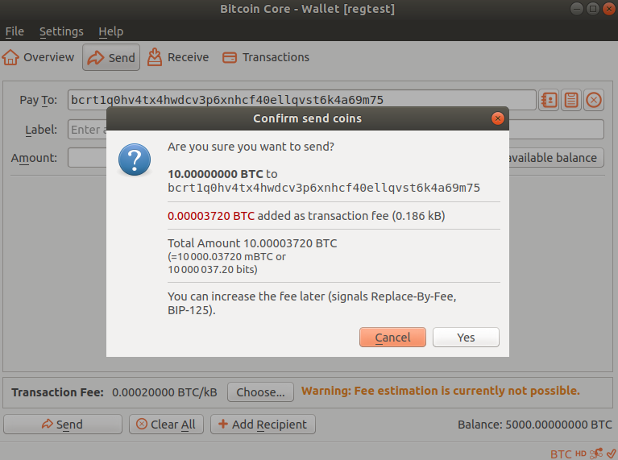

# Setting up a test environment with two LIT nodes
This tutorial will help you set up a test environment with two LIT nodes and a Bitcoin regtest on your computer.

## Step 1: Install Bitcoin Core in Regtest mode
The first step is to download Bitcoin Core, and run it in regtest mode. This allows for easy (simulated) mining of new blocks, and does not make you dependant on obtaining official testnet coins.

[Download Bitcoin Core](https://bitcoin.org/en/download) and install it. Before running it, make a file called bitcoin.conf with the following contents:

```
regtest=1
dnsseed=0
upnp=0
port=18444
server=1
txindex=1
```

and place it in the correct location depending on your operating system:

| Platform | Location |
|----|----|
| Linux   | `$HOME/.bitcoin/` |
| Windows | `%APPDATA%\Bitcoin` |
| MacOS   | `$HOME/Library/Application Support/Bitcoin/` |

Then, startup Bitcoin Core. 

## Step 2: Generate the first blocks

Bitcoin Core will start in regtest mode (you can see this in the window title). It will show you a progress indicator like this:

 

Since this is an empty blockchain right now, you need to generate some blocks to get it going. So go to `Help` > `Debug Window`, and then click the `Console` tab. Then type the command `generate 200` and press enter:


If you go back to the main window, the progress indicator will be gone and we have 5000 BTC on our own regtest blockchain to spend. 

## Step 3: Install the LIT nodes

Now the blockchain is up, we can install the LIT nodes. Download the latest binaries for your platform from [here](https://github.com/mit-dci/lit/releases) and unpack them in a new folder. Create two subfolders in that folder too, called `lit1` and `lit2`. Create a file called `lit.conf` with the following contents:

```
reg=localhost
rpchost=0.0.0.0
rpcport=8001
tracker=http://hubris.media.mit.edu:46580
autoListenPort=:2448
autoReconnect=true
autoReconnectInterval=5
```

Copy the file to both folders (`lit1` and `lit2`). Open the copy in the `lit2` folder and change the `autoListenPort` to `:2449`, and `rpcport` to `8002`.

## Step 4: Starting the LIT nodes

Open two terminal or command-line windows (`cmd.exe` on Windows, `xterm` on Linux, `Terminal` on MacOS) and `cd` to the directory where you put the LIT assemblies. In the first window, type this command to start up the first LIT node:

(On Unix / MacOS:)
```./lit --dir lit1``` 

(On Windows:)
```lit.exe --dir lit1```

When starting up LIT will ask you for a passphrase to protect your wallet. You _can_ leave it empty in development/test scenarios but in general it's recommended to set a password.

Then, similarly for the first node, use the second terminal window to start the second node:

(On Unix / MacOS:)
```./lit --dir lit2``` 

(On Windows:)
```lit.exe --dir lit2```

## Step 5: Fund the LIT wallets

Now that the nodes are up, we should fund the wallets. Open another command line window, and go to the directory where you downloaded the binaries. We use the command line client `lit-af`. You can connect to the first LIT node using the following command:

(On Unix / MacOS:)
```./lit-af``` 

(On Windows:)
```lit-af.exe```

Next, issue the `ls` command. You'll see your address printed out to the console:

```
lit-af# ls
entered command: ls
	Listening Ports:
Listening for connections on port(s) [:2448] with key ln1a9pp6jv4rgz0r7wh9tqcn89ndqv0mytr095tnp
	Addresses:
0 bcrt1q0hv4tx4hwdcv3p6xnhcf40ellqvst6k4a69m75 (mrzP7h3AQyxhWqVBh7TYBVzVDiaAM8R2AY)
	Type: 257	Sync Height: 200	FeeRate: 80	Utxo: 0	WitConf: 0 Channel: 0
```

Then switch to your Bitcoin Core client and pay the address (in this case `bcrt1q0hv4tx4hwdcv3p6xnhcf40ellqvst6k4a69m75`) 10 BTC. 



Next, use the debug console to generate another block (use the command `generate 1`, we don't need 200 blocks this time).

When you issue the `ls` command again in `lit-af` you'll see that there's a Txo and a balance (behind `WitConf`):

```
lit-af# ls
entered command: ls
	Txos:
0 0a5ac3215c4a977ff104ae9c22569fb85fb310a4fde8dd06a0e68bff3fba5a59;0 h:201 amt:1000000000 /44'/257'/0'/0'/0' regtest
	Listening Ports:
Listening for connections on port(s) [:2448] with key ln1a9pp6jv4rgz0r7wh9tqcn89ndqv0mytr095tnp
	Addresses:
0 bcrt1q0hv4tx4hwdcv3p6xnhcf40ellqvst6k4a69m75 (mrzP7h3AQyxhWqVBh7TYBVzVDiaAM8R2AY)
	Type: 257	Sync Height: 201	FeeRate: 80	Utxo: 1000000000	WitConf: 1000000000 Channel: 0
```

Repeat the funding steps for the second node, only use an extra parameter to `lit-af` to connect to it (since it's running on another port):

(On Unix / MacOS:)
```./lit-af -p 8002``` 

(On Windows:)
```lit-af.exe -p 8002```

## Step 6: Connect the nodes together

In order for the nodes to connect to each other, you need to find out the address of the first node, and then instruct the second node to connect. Connections are bi-directional, so they don't both need to connect to each other.

First, find out the address on the first node by issuing the `ls` command again. You will see something like this:

```
Listening Ports:
Listening for connections on port(s) [:2448] with key ln1kj56x2dl6c58waen2hmkfnh8u7w0n0hgmdzsna
```

The key `ln1....` is the LIT address for this node. Then, in the `lit-af` console for the second node, enter this command:

```
con ln1kj56x2dl6c58waen2hmkfnh8u7w0n0hgmdzsna@localhost:2448
```

The console will respond with:

```
entered command: con ln1kj56x2dl6c58waen2hmkfnh8u7w0n0hgmdzsna@localhost:2448
connected to peer ln1kj56x2dl6c58waen2hmkfnh8u7w0n0hgmdzsna@localhost:2448
```

The nodes are now connected together. 

## Next steps

Now that you have a set up with two LIT nodes, you can continue with some interesting things, we cover in follow-up tutorials:

* Form and use payment channels
* Offer and settle Discreet Log ContractsYou 
